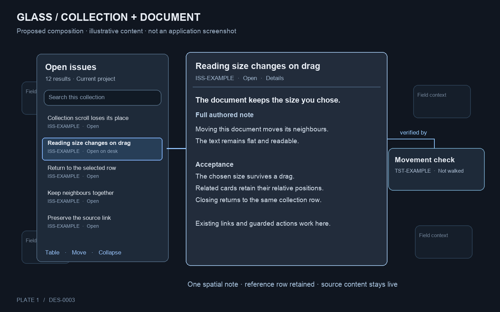
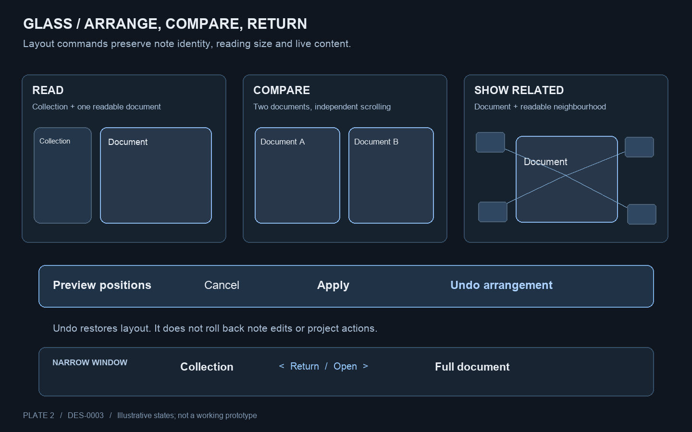

# Collections and documents on Glass

## Problem

Glass's collections and full note text currently compete with fixed columns and small panes. The existing focus specification also preserves duplicate neighbour cards and changes a document's size or arrangement when it moves. These behaviors prevent the person from treating the field as a dependable workspace.

Edwin endorsed the interaction review and asked for complete supporting documentation. The direction is adopted for planning. This new specification makes its behavior concrete; it remains proposed because the illustrated composition and motion calibration have not been tried. No picture below depicts a delivered application screen.

## Approach and delivery ownership

One subject has one spatial object on a desk. Its collection row remains a reference to that object. A collection owns a query and its presentation; it does not own a separate copy of the notes.

| Delivery | Owner | Outcome |
| --- | --- | --- |
| Continuity repair | FEAT-0017 / TASK-0104 | Existing cards move into the neighbourhood; chosen sizes survive dragging; no duplicate card or empty ghost. |
| First usable desk | FEAT-0020 / TASK-0095–0099 | A readable collection and full document share Glass, with clear input, return, refresh and accessibility behavior. |
| Reversible arrangements | FEAT-0022 / TASK-0101–0103 | Stack/table/card presentations and Read/Compare/Show related layouts preserve identities and can be undone. |
| Saved scenes and handoff | FEAT-0023, backlog | Later persistence and cross-screen recovery decisions are recorded in that feature before implementation. |
| Structured evidence and information levels | FEAT-0021, backlog | Later cockpit contracts supply reliable verdicts and traces. Existing linked notes can already use the document model. |

ADR-0006 records the decision to put the collection and full text on the desk. DES-0002 remains the source for the cylinder, bands and broader application concept. This design replaces its fixed list/reader placement for Glass and the focus assumptions identified in the impact section below.

## Plate 1: collection, document and relationships

Plate 1 is an illustrative arrangement, with invented sample content and counts. The collection and document are movable objects on the same surface. The selected row points to the open document. A related note is a single spatial object; its relationship label describes source data. The field remains available behind them.

### Object identity and selection

- Use workspace identity plus canonical note identity for every spatial note. A title or path display string is not sufficient identity.
- Opening an already open note locates and raises its existing document in that desk. A row can remain visible with an “Open on desk” indication without becoming a second spatial card.
- A note shared by visible neighbourhoods has one spatial card or document, with multiple reference rows or connection lines. Closing the collection must not close a document opened independently. This release plans one view collection; multiple independently queried collections remain outside FEAT-0022.
- Keep the initiating collection, selected row and scroll anchor for a return. If the row no longer belongs to the query, explain that and return to the collection's nearest surviving anchor.
- The exact list is the recovery route for members not placed in the field. Distinguish total members, visible spatial members and unplaced members. This design does not settle ISS-0086 by renaming unplaced notes as placed.

### Readable document and continuous opening

The document shows the sidecar-rendered authored text with its existing links, checkboxes and guarded actions. A compact header can show supported goal, status and labelled progress. A summary must never require another click before the text.

Show a human title first, then compact ID and state. Keep the full source path available in details and accessible names without allowing it to dominate the heading. Give the document body a nearly opaque surface and keep its text flat. Header edges may be translucent without blur.

Opening from a field card starts at that card. Opening from a row indicates the row as the source; it must not fly from an unrelated off-screen slot. Bring the full document to its chosen reading size while retaining input. Prototype 250–400 ms against the current one-second movement; select the duration from the walk and measurements. This is a trial range, not a latency promise.

On first use, choose a reading size that fits a useful column of prose alongside the collection when space permits. The typography trial is approximately 60–80 characters per text line at the user's text scale. The proposed precedence is the note's saved size, then the desk's persisted per-view reading-size preference, then the calibrated first-use size. Explicit resizing updates the note's size and that per-view preference through the existing store, so another window on the same view can use it. Moving never changes either. Older state with no preference uses the first-use default. A temporary narrow layout must not overwrite the saved size or preference. Camera and focus persistence remain unchanged. A narrow viewport uses one foreground object with an explicit return, rather than shrinking prose to fit two objects.

If text must load, immediately show the identified document frame and an honest loading state. Render the full text when available without waiting for the motion to finish. A fetch failure keeps the title, source and Retry/Close controls; it never presents a summary as the complete note. Loading neighbours must not block reading the document.

### Neighbourhood and materials

Move the existing related cards at readable browsing size. Keep their relative order and the document's chosen dimensions. The neighbourhood may extend beyond the viewport. Direction indicators, “Find open note” and a complete relationship list keep it reachable.

A link can say “parent”, “implements” or “verified by” only when the current source reports that relationship. Otherwise show a generic incoming or outgoing link. Keyboard focus exposes the same source explanation as pointer hover. No spatial drag changes an authored relationship or obligation.

The document's background shields text from the moving field. Use a dark neutral field, modest edge accents and small shadows; respect text scaling and contrast preferences. Colour supplements labels and focus outlines. Movement settles while reading. Do not add blur or backdrop filters over the moving field, persistent particles, or compulsory pulsing.

## Plate 2: reversible arrangements and narrow layouts

Plate 2 shows three requested layouts over the same objects. Preview changes no saved arrangement. Apply records one reversible layout operation. On a narrow display, the same collection and documents remain reachable one at a time. These are FEAT-0022 capabilities after the FEAT-0020 foundation.

### Collection presentations

| Presentation | Behavior |
| --- | --- |
| Stack | Named compact object with exact result count and active-filter indication. Expand restores the previous presentation, selection and scroll anchor. |
| Table | The complete derived groups and rows, with search, filters, sort, group folds and keyboard navigation. Long results may be virtualized while retaining full membership. |
| Cards | Arrange the same result identities spatially. Already visible objects are reused; changing the collection to Cards cannot duplicate a note already open or in a neighbourhood. State how many members are currently drawn and how to reach the rest. |

Changing presentation cannot silently add a filter or change the count. Reordering or layout changes are desk operations, not source edits. Applying a changed query announces the new membership and preserves a removed selection as an open document with an explanation.

### Arrangement commands

- **Read:** make the selected full document and its collection accessible together. Use the document's reading size and position the collection beside it when the viewport permits.
- **Compare:** arrange two selected documents side by side in the wider desk. Preserve their sizes and independent scroll positions. If both cannot fit, offer the narrow navigation route; do not reduce their text scale.
- **Show related:** expose the selected document's neighbourhood while keeping the collection reachable. Relation filters emphasize requested source-backed relations; the full relationship list and its total remain available.
- **Undo arrangement:** restore the previous positions, sizes, stacking and presentation for the objects this command moved. Preserve live note content and any source writes. The command does not mean undo a project action.

The preview identifies every object that will move. Cancel restores the unchanged desk. Explicitly hand-placed objects outside the selected arrangement remain where they are. New data arriving during a preview invalidates or refreshes that preview visibly before Apply; a stale preview must not overwrite a newer arrangement.

Scene persistence is a later extension. Normal per-view collection identity, filters and layout follow the existing desk. Window scroll anchors and transient focus remain local. New arrangement undo is session-local. Do not save yaw, focus or the undo history under the label of a scene until FEAT-0023's persistence decision is made.

## Input and focus contract

| Input | Result |
| --- | --- |
| Wheel over document/table | Scroll that object's content. Reaching its edge does not pass the gesture to the field. |
| Wheel over field | Preserve current spatial zoom; sideways wheel or Shift turns it. No gesture changes the cockpit information level. |
| Drag authored text | Select text. Links and checkboxes retain their existing action. |
| Drag object header | Move the object. A focused document moves with its neighbourhood and retains its size. |
| Drag resize control | Resize deliberately and retain a reachable header. The same operation has a keyboard route. |
| Select a row/card | Open or raise the existing document and retain the initiating focus anchor. |
| Tab or explicit object navigation | Reach collection controls, rows, document controls/body and relationship list in a stable order. Reveal a covered focused control without changing source selection. |
| Escape with a local menu, preview or active drag | Cancel or dismiss only that local state. Consume the event so it cannot also clear the desk. |
| Escape with focus mode, no local state | Leave focus mode and restore the previous field arrangement as far as surviving objects permit. Keep held documents. |
| Escape with no local state or focus mode | Retain the existing sweep behavior; expose the equivalent named control. A close-document control returns to its row instead. |
| Reduced motion | Perform the same state changes directly and show a static focus/arrival indication. No compulsory travel or scale animation. |

The served tablet remains read-only and cannot arrange the shared host desk or invoke writes. Its viewport can navigate locally between the collection and readable documents through existing read routes. On desktop, arranging geometry leaves source notes unchanged; intentional writes still use the shell and sidecar guards.

## State and recovery cases

| Case | Required result |
| --- | --- |
| Zero results | Name the query and filters, show zero, and offer Clear filters. No empty field that implies the application failed to load. |
| Loading/error | Distinguish waiting from empty; keep retry and context available. Cached content, if shown, is labelled. |
| Refresh while pointer or keyboard is on a row | Announce changed results before applying a reorder. Retain the selected identity and anchor. |
| Selected note deleted or inaccessible | Keep a labelled missing/unavailable document with Close and source context. Never substitute a different note. |
| More neighbours than fit | Keep readable cards in the larger arrangement and expose an exact list/directional recovery route. Do not shrink the reader to fit a fixed number. |
| Interrupted opening or view switch | Finish at the latest requested state; no stranded invisible object, duplicate card, or detached keyboard focus. |
| Narrow window or larger text | Use one foreground object and explicit return/navigation. Retain collection state and independent document scroll positions. |
| Second display disappears | Keep each open document reachable on a remaining host window without duplicating its spatial identity. FEAT-0023 specifies scene restoration and enhanced handoff later. |

## Impact, precedence and open decisions

The sidecar remains authoritative for note content, legal actions and owed work. The current view description determines presentation and membership from its existing source. No new cockpit flow or status rule is inferred from a visual grouping.

ISS-0070/71/72 already record Edwin's choice to remove duplicate cards and the ghost, respect chosen size, and move the neighbourhood. TASK-0104 owns those repairs under FEAT-0017. FEAT-0020 depends on that task for final acceptance. Earlier completed task notes remain historical evidence; the current feature, plan and TST-0052 now state the intended repaired behavior.

This changes FEAT-0017's earlier fixed sixteen-mini-card, forced-size and drag-to-exit assumptions. It also permits multiple readable documents on the Glass desktop through FEAT-0020 and FEAT-0022, instead of mandating docked headers for all other documents. Orbit retains its own arrangement behavior except for the shared identity, chosen-size and neighbourhood repairs. No whole-graph redesign is implied.

The endorsed direction authorizes these planning changes. Exact transition timing, typography, first-use dimensions and relation label availability remain implementation calibration work under TASK-0096/0097/0099. Record measured outcomes there. Saved scene identity, persistence migration, stale-member recovery and cross-screen ownership remain decisions in FEAT-0023. New evidence payloads and information-level addresses remain FEAT-0021 dependencies. These later decisions do not block the first readable desk.

## Verification

TST-0052 walks the continuity repair, TST-0063 walks the collection and full document, and TST-0064 walks presentations and reversible arrangements. All remain unwalked for this design. Automated checks should target identity, exact membership, input dispatch, interrupted transitions and restoration; screenshots alone cannot prove these properties.

The walk records time to find a note, compare two documents, follow a source and return, plus mistaken selections and lost-context incidents. Measure foreground cadence, rendering work, stalls and memory with long notes and the full corpus. Separate collection reachability from simultaneous painting. Keep TASK-0092's native benchmark separate; it does not establish a rewrite advantage or verify these new interactions.

## Out of scope

New write routes, writable tablet control, headset implementation, a Rust migration, automatic authoring of relationships, and acceptance of the cockpit's proposed four flows or seven levels. Their boundaries and forward homes are retained in the linked feature notes.

## Revisions

- 2026-10-01 — Documented the endorsed review as a delivery specification with two illustrative plates. Existing runtime behavior has not changed.

## Review

Direction endorsed by Edwin: “This sounds great update the documents to support this fully.” The detailed specification and pictures have not had an independent review or usability walk.
