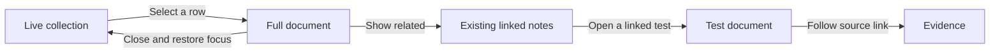

# Make Glass feel like one controllable workspace

## Recommendation

**Planning follow-through:** Edwin endorsed this review with “This sounds great update the documents to support this fully.” [[DES-0003-Collections-And-Documents-On-Glass]] now specifies the direction. FEAT-0020 carries the foundation, FEAT-0022 the reversible arrangements, FEAT-0023 the later scenes, and FEAT-0021 the later structured evidence. TASK-0104 owns the existing continuity repairs. This reference remains the research rationale; the linked implementation notes own current scope and acceptance.

Keep the proposal to put live collections and full documents on Glass. Give those objects a consistent way to open, gather related material, move together and return to their previous arrangement. That is the strongest next step toward the Minority Report interaction Edwin wants.

The current plan establishes where the objects live. Its main design gap is how several objects behave together. A movable list and a movable reader could still feel like ordinary windows. Glass becomes distinctive when selecting a result visibly brings forward the same note, its relationships remain understandable, and every arrangement is recoverable.

This review enables a choice of interaction refinements and later enhancements. It proposes no change to accepted requirements, feature status, source data or renderer architecture.

## What was reviewed

- The October 1 Glass review, proposed ADR-0006, FEAT-0020, its two requirements, TASK-0095 through TASK-0099, and TST-0063.
- FEAT-0021 and the cockpit's DES-0015 and DES-0016. Their four flows and seven information levels remain proposals for later adoption.
- DES-0002, PHASE-0002, per-view desk and focus feature notes, and the existing duplication, reading-size, movement, action-strip and placement issues.
- Relevant paths in `desktop/src/renderer/glass.ts`, `desktop/src/renderer/deck.css`, and `desktop/src/shared/panes.ts`.
- Retained production Electron captures `prototypes/native-glass/local/runs/production-real-os-zoom-duration-r300.start.png` and `production-real-os-hover-duration-r269.end.png`. These show a frozen Your Trainer fixture. They are existing diagnostic images, not a new live usability walk.
- TASK-0092 and the single-run comparison in `docs/features/native-glass-evaluation/plan/EVIDENCE.md`.

The captures show long paths taking scarce card space, densely overlapping background text, and a small document with little room for authored content. That supports FEAT-0020's reading-size direction. It also suggests that typography and composition deserve as much attention as motion.

## Comparable applications and useful lessons

The descriptions below come from product documentation or research authors. The recommendations for Glass are this review's inferences, not evidence that these patterns have already succeeded in Deck.

| Application or research | Documented pattern | Proposed application to Glass |
| --- | --- | --- |
| [Oblong Mezzanine](https://static.carahsoft.com/concrete/files/2714/6049/2714/Mezzanine-by-Oblong.pdf) | Oblong's 2015 brochure describes a shared canvas across displays, movable content windows, automatic grids and saved workspaces. It explicitly connects the company's technology to Minority Report. This is a historical precedent, not a current availability claim. | Make moving a document between screens preserve its identity, size and reading position. Offer useful arrangements and recovery alongside free movement. |
| [MIT Gestural Interaction](https://tangible.media.mit.edu/project/gestural-interaction/) | Research using Oblong's g-speak explores movement between physical, graphical, ambient and direct interaction. | Let an object have a quiet background state and an immediately usable foreground state. A desktop pointer can express that transition without special hardware. |
| [Allume, formerly Muse](https://allume.com/) | Its current site describes nested boards containing text, cards and media. It deliberately excludes endless canvas zooming and rotation. | Use understandable collections and named places to structure the desk. Glass can retain its cylinder while adding reliable ways to return to work. |
| [Heptabase](https://wiki.heptabase.com/version-one) | Its 1.0 account documents nested whiteboards, sections, automatic layout assistance, and source highlights placed on boards. | Add optional tidy and compare arrangements. Later, bring an evidence excerpt beside the claim it supports, with a link to its source. |
| [Obsidian Canvas](https://obsidian.md/canvas) | Existing notes and media can be embedded and notes edited directly within a canvas. | Treat the document as the actual note representation. Preserve its links, checkboxes and identity when opened from a collection. Deck's own action guards still apply. |
| [TheBrain](https://thebrain.com/blog/navigating-beyond-the-plex) | The active thought has mapped relationships, a matching linear outline, navigation history and pins. | Give each visible relationship a meaning and a corresponding accessible list. Provide a direct route back after following several links. |
| [Apple spatial design](https://developer.apple.com/videos/play/wwdc2023/10072/) | Apple recommends subtle depth with supporting visual cues and flat interface text. | Use depth around readable content. Keep document text facing the reader and reserve translucency for boundaries and controls. This is an adaptation to a monitor, not evidence that monitor and headset ergonomics are interchangeable. |
| [Freeform scenes](https://support.apple.com/en-mide/guide/iphone/iphbe64aa259/ios) | Scenes capture named areas of a board and support navigation and presentation. | Consider named arrangements for review, comparison and evidence. Saving camera orientation would require an explicit extension to Glass's current session-state rules. |

## Assessment of the proposed updates

| Proposal | Assessment | Refinement needed before implementation |
| --- | --- | --- |
| Put the derived collection on the desk | Strong foundation. It makes the exact result set available where work happens. | Specify default position, readable minimum size, collapse/restore, focus order and scrolling. Moving the existing 264-pixel sidebar unchanged would preserve its cramped presentation. |
| Open full notes on the desk | Highest immediate visual and practical payoff. | Use a comfortable initial reading surface and respect the person's later size. The full text must remain available while opening motion runs. |
| Keep one identity across row, card and document | Essential for believable movement. | Distinguish the collection's reference row from the single spatial note object. Opening the note may keep its row, but must remove duplicate cards and the unwanted empty frame. |
| Keep related notes around the document | Promising, with known continuity defects. | Move the existing cards at readable size. Preserve their arrangement on a drag. Off-screen neighbours need a visible route back; do not shrink the document to force them into the viewport. |
| Add project-to-evidence levels | Valuable later, but too large to make the first Glass improvement depend on it. | Preserve explicit navigation between information levels. The field wheel should continue controlling spatial zoom. |
| Pursue native rendering | Separate architecture experiment. | Current evidence does not establish a Rust speed advantage. Design and measure the next useful interaction in Electron. |

The last point follows the existing comparison. Electron's callback interval p95 was 17.4 ms; Rust's submitted-frame CPU p95 was 25.06 ms. Those measure different endpoints and cannot yield a speed ratio. The paint mismatch and single repetition also limit the conclusion.

## Recommended interaction refinements

### 1. Make opening a note a clear, continuous event

Selecting a field card should expand that same visible object into a document. Selecting a collection row should visibly connect the row to the document's arrival. Keep the row highlighted as a reference, with an “Open on desk” indicator. Do not create an extra field-card copy.

Show the human title prominently, then the compact note ID and state. Put the full file path behind a details control. The retained capture's path-heavy headers weaken the hierarchy before any animation starts.

Prototype an interruptible 250–400 ms opening transition against the existing roughly one-second sequence. This duration is a design candidate, not a validated usability threshold. The document should accept input promptly and must not wait for neighbour animation before showing text. Reduced motion should perform the same state change directly.

Closing returns the object to its reserved position without drawing a permanent ghost. If that position is off-screen, briefly indicate its direction and restore focus to the initiating row or control. These refinements belong with TASK-0097/0098 and the existing ISS-0070/71/72 decisions.

### 2. Make collections expandable objects with useful shapes

Start with the planned readable table and collapsed header. Give the header its query name, exact count and active filters. Expanding should restore its previous size, scroll anchor and selection.

A later enhancement could offer three presentations of one collection: a compact stack, a table, and an expanded card arrangement. For example, an “Open issues” stack opens into its rows; “Arrange results” places those same members on the desk. Changing presentation must not change membership or issue status.

This is the most promising new visual interaction. The table supports scanning, and the expanded arrangement supports comparison. Animate only visible objects and retain a route to every member. Do not confuse temporary draw limits with a limit on the collection itself. Multiple independently filtered collection objects and fan-out layouts extend the current feature and need their own scope decision.

### 3. Make the surrounding relationships explain the note

Give connections labels such as “parent”, “implements” or “verified by” only when the source data supports that meaning. Otherwise show an honest generic link direction. A visual line without a clear meaning contributes little to a review.

Keep the existing chosen neighbourhood arrangement and readable cards. A later relation filter could emphasize only requirements, tests or blockers while retaining an exact linked list of all neighbours. That would let the person inspect one relationship without replacing the underlying graph.

When two held notes share a neighbour, use one spatial card with two connections. Keep its identity stable when focus changes. Avoid a full graph of every edge behind the reader; show the relationships relevant to the current selection or a deliberate command.

### 4. Help the desk arrange itself when asked

Offer an arrangement control with understandable results: “Read”, “Compare” and “Show related”. Read gives the document a comfortable column and leaves its collection accessible. Compare places two selected documents alongside one another. Show related restores room for their neighbourhood.

Preview the positions before applying an arrangement. Preserve text size and never silently shrink a person's document to fit. When the viewport cannot accommodate the requested arrangement, use the wider workspace or the narrow-window navigation already planned.

Provide a labelled undo for the last arrangement. Moving furniture should be reversible independently of editing note text or invoking a project action. Automatic layouts, arrangement undo and persistent presets are extensions to the current plan; they should be designed together rather than hidden in a renderer refactor.

### 5. Make depth and materials serve reading

Use a dark neutral field, restrained accent light at active edges, and clear separation between background cards and foreground work. Give collections, documents and evidence distinct header treatments so their roles remain recognizable without colour.

Prototype nearly opaque document bodies, quieter translucent header edges, and flat text at the chosen reading size. Use small shadows and restrained scale changes to show elevation. Keep perspective strongest in the surrounding field. Long documents should not tilt or shrink when the camera turns.

Use short feedback when something is selected, placed or updated. Settle to a still screen while the person reads. The existing renderer explicitly avoids blur and backdrop filters over the moving field; retain that constraint. Decorative particles and continuous pulsing would compete with the information and consume rendering budget.

### 6. Bring evidence beside the claim

In a later extension, “Show evidence” should bring linked captures, test verdicts or source excerpts beside the relevant acceptance statement. Each object should show where it came from, its date and a route to the full source. Missing or stale evidence should remain visible as such.

This would be a distinctive use of Glass's spatial layout: a reviewer can see the requirement, the claim and its proof together. Displaying an existing linked note can use the current document path. New structured verdicts, excerpt anchors and trace panels depend on reliable source contracts and belong with FEAT-0021 or separately scoped work.

### 7. Let a person return to a useful arrangement

First provide “Find open note”, “Return to collection” and a clear route to the front of the field. They make off-screen content manageable without changing the current persistence contract.

Later, add named scenes such as “Review Glass” or “Compare two designs”. Store note/query identities and layout references, then resolve fresh content when reopening. Show missing notes explicitly. Do not save a copied result set and present it as current.

Saved camera orientation, scene history and bookmarks extend today's session-only yaw and focus rules. Record that decision before implementation. A scene restored on a smaller display should keep its objects reachable and explain any changed arrangement.

### 8. Polish the cross-screen handoff

Glass already has throw and named-window send behavior. Build on it: reveal the destination before release, show an arrival indication, preserve reading position, and provide a return command. A named-window action must remain available to keyboard users.

Use the served tablet as a readable companion within its current authority. Turning it into a remote control, adding writable synchronization, or introducing headset input is separate work. A future headset client should reuse object identity and actions, with its own ergonomic layout and input evaluation.

## Interaction rules the specification should make explicit

| Input or situation | Recommended behavior |
| --- | --- |
| Wheel over a document or collection | Scroll its content. At a boundary, do not unexpectedly turn or zoom the field. Existing `Glass.onWheel` already exempts panes; extend the protection to collections. |
| Wheel over the field | Preserve the current spatial zoom/turn rules. Do not switch to another information level. |
| Drag document text | Select text. Dragging a clearly marked header moves the object. |
| Drag a focused document | Preserve its size and move the neighbourhood as already chosen. |
| Keyboard movement through objects | Keep focus visible, bring covered controls into view, and restore the initiating row on close. |
| Escape | Give each state a predictable exit and avoid accidentally sweeping the desk after dismissing a local control. Reconcile changes with the current Escape contract explicitly. |
| Results change while reading | Announce the change. Retain the selected subject and anchor until the person applies the update. If the subject leaves the result, explain why. |
| A count includes unplaced notes | Open the exact member rows. Label field placement separately; exact collection access does not close ISS-0086's spatial-placement question. |
| The note is already open | Locate or raise its existing document. Do not generate another spatial copy in the same desk. |

## A demonstration worth building

Use a current view and real data so the demonstration can precede the cockpit's new level contracts.

1. Open an Issues collection on Glass. Its count and filter are readable immediately.
2. Select an issue. Its full document arrives at a comfortable size while the selected row remains apparent.
3. Reveal its connected feature and tests. Move the issue with its neighbours; the text size stays fixed.
4. Open a linked test and arrange the two documents for comparison. Follow a real evidence link if one exists.
5. Send one document to another screen and return attention to the same collection row.

The first three steps exercise the planned feature and existing continuity fixes. Compare arrangements and improved handoff are additional proposals. A later scene command could restore the whole review arrangement.

## Priority and delivery boundaries

| Order | Work | Relationship to existing plan | Effort judgment |
| --- | --- | --- | --- |
| 1 | Repair duplicate cards, chosen-size handling and neighbourhood movement; define the collection/document input rules | Existing ISS-0070/71/72 and FEAT-0020 dependencies | Foundational, likely substantial |
| 2 | Readable collection and document, title hierarchy, visible focus, continuous opening and return | Refines TASK-0095–0098 | Moderate, alongside planned work |
| 3 | Compare/tidy arrangements, undo and optional collection expansion | New enhancement scope | Moderate to substantial |
| 4 | Relationship filters and evidence alongside claims | Existing graph can support part; new evidence contracts may be needed | Data-dependent |
| 5 | Named scenes and improved cross-screen continuity | Extends persistence and window behavior | Substantial |
| 6 | Home, four flows, explicit information levels, structured traces, headset interaction | FEAT-0021 or separate platform work | Later decisions |

Effort labels are comparative judgments, not implementation estimates. The best initial investment is the full-document opening and return, followed by arrangements for two documents. Those make the collection/document model visible and useful in a short demonstration.

## How to judge whether it is better

Extend the planned TST-0063 walk when an enhancement is accepted. Use a long note, multiple documents, a high-degree subject, and a result whose field has unplaced cards. Check exact membership and identity alongside the visual result.

Observe whether a person can find the requested note, compare two notes, follow a source and return without searching again. Record completion time, mistaken selections and lost-context incidents. Compare the existing UI with the proposed interaction before deciding that added animation improves it.

Exercise interrupted motion, keyboard-only operation, reduced motion, overlapping panes, text selection, scroll boundaries, a narrow window and a disconnected second display. Verify that arranging objects leaves source notes unchanged and that intentional writes retain their existing guards.

Measure foreground frame cadence, script/render work, stalls, memory and interaction response with collections and full documents present. Use the full source population and distinguish reachability from simultaneous drawing. The 16.7 ms budget describes a 60 Hz frame; a callback interval alone is not input-to-photon latency. Reuse the native evaluation's provenance discipline without making renderer migration a prerequisite.

## Verification and maintenance

This is a proposal and source review. No new application interaction, benchmark or comparative user test was run. External application features were checked in primary documentation; the applications were not installed or tested for this review. Suggested sizes, durations and arrangements require prototyping.

Revisit this note when FEAT-0020 receives an interaction design, ISS-0070/71/72 or ISS-0086 changes, or the cockpit accepts its flow/level contracts. Keep accepted changes in their feature and decision notes. Preserve this review as the rationale and comparison record.
